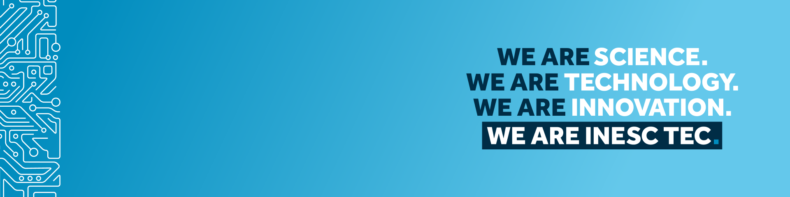

<div align="center">



## INESC TEC
# Contributing to Relay-D

</div>

Thanks for your interest in contributing! This document covers how to set up a
development environment, coding conventions, and the pull-request process.

## Development setup

Relay-D targets **Ubuntu 24.04**, **ROS 2 Jazzy**, and **Python ≥ 3.12**. It is
a plain pip package, not a colcon/ament package.

```bash
# 1. Source ROS 2 and install the ROS 2 packages this project depends on
source /opt/ros/jazzy/setup.bash
sudo apt install ros-jazzy-tf2-ros ros-jazzy-geometry-msgs ros-jazzy-std-msgs \
    ros-jazzy-sensor-msgs ros-jazzy-cv-bridge ros-jazzy-image-transport

# 2. Clone your fork
git clone git@github.com:<your-username>/Relay-D.git
cd Relay-D

# 3. Install in editable mode with dev dependencies
pip install -e .
pip install --group dev .
```

See the [README](README.md#dependencies) for the full dependency list,
including the optional `robomimic` extra.

## Making changes

1. **Open an issue first** for anything beyond a trivial fix, so the approach
   can be discussed before you invest time in an implementation.
2. **Create a branch** off `master` named descriptively, e.g.
   `fix/postprocess-page-crash` or `feat/add-force-topic-support`.
3. **Keep commits focused** — one logical change per commit, with a clear
   commit message describing *why*, not just *what*.
4. **Match existing style** — this codebase doesn't yet enforce a formatter or
   linter in CI (see `.github/workflows/ci.yml`), but please follow the
   conventions already used in the file/module you're editing (naming,
   docstring style, import grouping).
5. **Update the README** if you change installation steps, CLI flags, or the
   package layout.

## Regenerating Qt UI files

If you edit a `.ui` file under `relay_d/acquisition/qt_app/ui/`, regenerate its
compiled counterpart with `pyuic5` from the repo root (so the generated header
comment records a relative path, not your local absolute path):

```bash
pyuic5 relay_d/acquisition/qt_app/ui/containers/mainWindow.ui \
    -o relay_d/acquisition/qt_app/ui/containers/mainWindow_ui.py
```

If you change `resources.qrc` (icons/images), regenerate `resources_rc.py`
with `pyrcc5` the same way.

## Submitting a pull request

- Rebase on the latest `master` before opening the PR.
- Describe **what** changed and **why** in the PR description; link the
  related issue if one exists.
- Note any manual testing you did — this project currently has no automated
  test suite exercising the ROS 2-dependent code paths (CI only does a
  dependency-installable-subset build/lint check), so a clear description of
  how you validated the change (e.g. "ran `RelayDApp`, recorded a demo,
  converted it") is genuinely useful to reviewers.
- A maintainer will review and may ask for changes before merging.

## Reporting bugs / requesting features

Use the issue templates under **Issues → New Issue**. Please include:
- Relay-D version / commit, ROS 2 distro, OS.
- Steps to reproduce (for bugs), or the use case (for features).
- Relevant logs or stack traces.

## Code of Conduct

This project follows the [Contributor Covenant](CODE_OF_CONDUCT.md). By
participating, you're expected to uphold it.

## License

By contributing, you agree that your contributions will be licensed under the
project's [GNU GPLv3](LICENSE).
